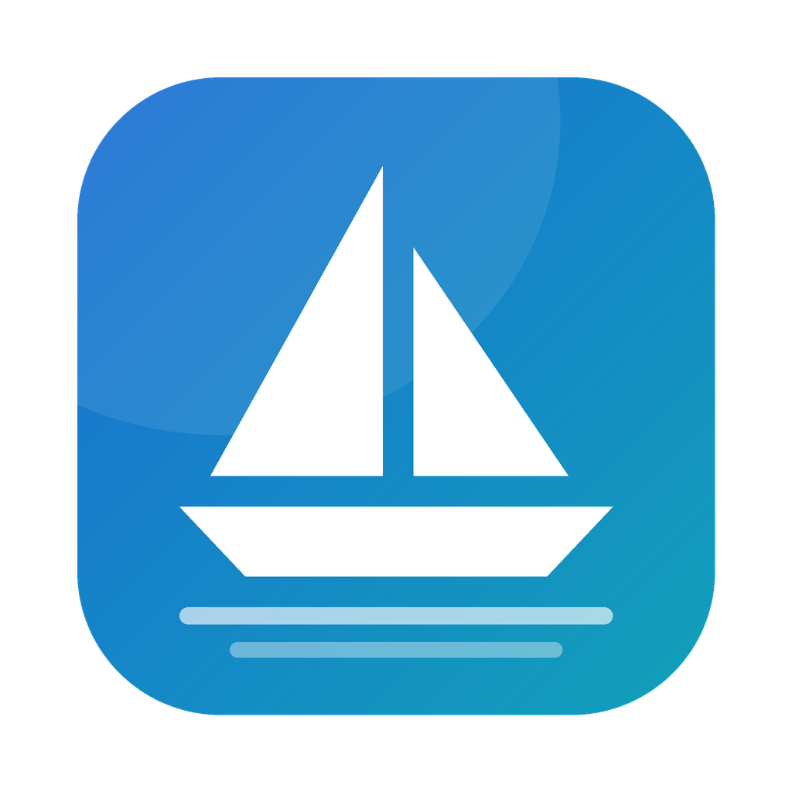

# Portside

An open-source, native **macOS** app for managing Docker on your NAS — or any TLS-enabled Docker host — built with SwiftUI.

Portside talks to the Docker Engine API directly from your Mac over mutual TLS: the host's certificate chain is verified against the CA you import, your client certificate authenticates every request, and nothing passes through an intermediary server. It was built for QNAP Container Station, and works with any `dockerd` running with `--tlsverify`.



> Not affiliated with Docker, Inc. or QNAP Systems, Inc.

## Features

- **Dashboard** — host CPU / memory rings, container counts, live network throughput, and history charts (Live / 24h / 7d, persisted across launches), plus top-consumer leaderboards that jump straight to the container.
- **Insights** — an action list, not a metrics feed: crashes with exit codes, restart loops, failing health checks, pending updates, and reclaimable disk space. Only durable, actionable conditions appear — nothing that flaps in and out on its own. When there's nothing to do, it says so.
- **Containers** — a card grid (with live CPU sparklines) or a compact list. Compose projects group automatically into **stacks** with stack-wide start / stop / restart; manual groups, per-container nicknames, colors, and icons are saved locally.
- **Bulk actions** — select any set of containers and start, stop, restart, group, or remove them in one confirmed step.
- **Detail inspector** — live stats, ports (click to open in the browser), mounts, and every action — edit, export, deploy, remove — in a side panel.
- **Live logs** — streaming with ANSI colors, pause, search, and export to a file.
- **Terminal** — a real xterm-256color console (`docker exec`) into any running container, over the hijacked TLS stream.
- **File browser** — browse mapped volumes (or the full container filesystem), download, upload, and **edit config files in-app** via the Docker archive API.
- **Deploy wizard** — pull an image and create a container with ports, volumes, environment, restart policy, and resource limits. Or **import a docker-compose file**: services are previewed, created, and grouped as a stack.
- **Image update checker** — compares your containers' image digests against the registry (with proper bearer-token auth). One click pulls the new image and recreates the container — configuration preserved, automatic rollback on failure. Optional per-container **auto-update**.
- **Container export** — rebuild any container anywhere: export its live configuration as `compose.yml` or a `docker run` command.
- **Resource pages** — images, volumes, and networks show what's in use vs. unused vs. dangling, with per-object delete and a cleanup sheet that shows real reclaimable sizes. Destroying data always requires typing the name.
- **Crash log snapshots** — when a container dies, its logs are captured at that moment, so the evidence survives the container being recreated.
- **GitHub watch & Git Deploy** — watch repos for releases and commits; linked containers can pull a bind-mounted app folder from GitHub and restart — on demand, immediately on push, or nightly. Rollback to any recent commit.
- **Notification rules** — choose exactly which events interrupt you: crash, stop, unhealthy, restart loop, image update, GitHub activity, expiring certificates.
- **Multi-host** — manage several Docker hosts, each with its own TLS certificates, and switch between them from the sidebar.
- **Menu bar companion** — live rings, a CPU sparkline, and per-container quick actions in the menu bar; the app keeps monitoring (and notifying) with the window closed.
- **Command palette** — ⌘K to jump to any page or act on any container.
- **One-click updates** — optional check against GitHub Releases at launch plus "Check for Updates…" in the app menu; installing an update downloads, swaps the app in place, and relaunches automatically.
- **Themes** — six accent themes and a System / Light / Dark appearance override.
- **Local-only credentials** — registry credentials and the GitHub token are stored exclusively in the macOS Keychain; TLS keys never leave your machine.

## Installation

### Download

Grab the latest `Portside-x.y.z.dmg` from [Releases](https://github.com/Mac2100/Portside/releases), open it, and drag **Portside** into **Applications**.

> **Note on Gatekeeper:** releases are ad-hoc signed (no paid Apple Developer certificate), so the first launch requires right-clicking the app → **Open**, or:
> ```bash
> xattr -d com.apple.quarantine /Applications/Portside.app
> ```

### Build from source

Requires Xcode 15+ / Swift 5.9+ on macOS 14 or later.

```bash
git clone https://github.com/Mac2100/Portside.git
cd Portside
./scripts/make_app.sh          # produces dist/Portside.app and dist/Portside-<version>.dmg
```

For development, `swift run` works directly, or open `Package.swift` in Xcode.

## Connecting to your host

### QNAP Container Station

1. In Container Station, enable the Docker API: **Preferences → Docker Certificate**, and make sure port **2376** is on.
2. Download the certificate bundle (**Preferences → Docker Certificate → Download**) and unzip it — you get `ca.pem`, `cert.pem`, and `key.pem`.
3. In Portside: **Settings → Hosts**, add the NAS by IP, then **Import certificates…** and select all three files.

### Any other Docker host

Any `dockerd` started with `--tlsverify --tlscacert --tlscert --tlskey` works the same way — add the host and import the matching client certificates. Per-host certificate sets are supported for multi-host setups.

Portside verifies the host's certificate chain against the imported `ca.pem`. Because NAS certificates are typically issued to the device's hostname while you connect by IP, only the hostname check is waived — the chain, signature, and validity are always verified.

## Security & privacy

- TLS client certificates and keys stay on disk in the app's support folder; registry credentials and the GitHub token are stored **only** in the macOS Keychain.
- Every Docker API request goes **directly** from your Mac to your host over mutual TLS — there is no intermediary server and no telemetry.
- The only other network requests are registry digest lookups for the update checker, the GitHub API for watched repos, and the (optional, off-switchable) update check against the public GitHub Releases API.

## Upgrading from Portside 2.x

V3 is a full native rewrite of the earlier Electron app. It reads the same configuration file and certificate layout, so hosts, groups, container customizations, notification rules, and watch lists carry over automatically on first launch. Registry credentials and the Git Deploy token need to be re-entered once (they move into the Keychain).

## CI / Releases

Every push and pull request builds the app and uploads a DMG artifact via GitHub Actions. Pushing a tag like `v3.1.0` additionally creates a GitHub Release with the DMG attached — which is what the in-app update checker looks at.

To cut a release: bump `AppVersion.marketing` in `Sources/Portside/Support/AppVersion.swift`, then tag the commit `v<version>` and push the tag.

## Support

Portside is free and open source. If it saves you a few SSH sessions, you can say thanks with a coffee:

<a href="https://www.buymeacoffee.com/Mac2100" target="_blank"></a>

## License

[MIT](LICENSE)
